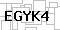
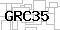
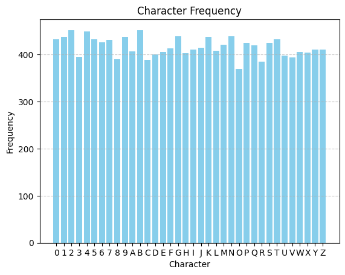
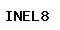
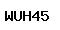
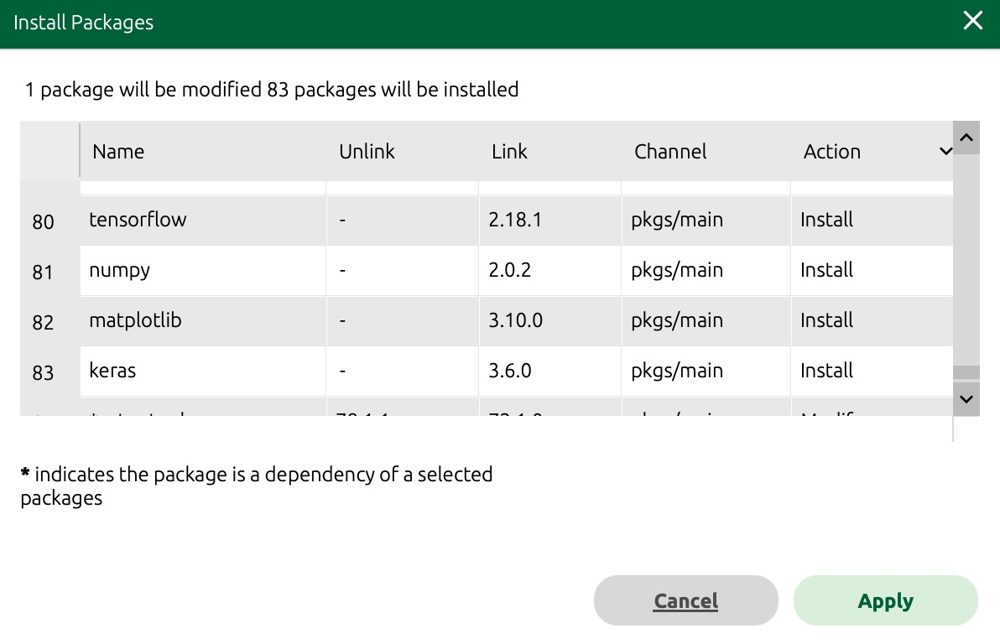

# Problem Statement
To train an AI model that is capable of predicting a 5-char CAPTCHA and output the predicted text.

The characteristics of the CAPTCHA include:
- the number of characters remains the same each time  
- the font and spacing is the same each time  
- the background and foreground colors and texture, remain largely the same
- there is no skew in the structure of the characters.  
- the captcha generator, creates strictly 5-character captchas, and each of the characters is either an upper-case character (A-Z) or a numeral (0-9).

# Approach 1 (Failed)
For efficiency, first step is to find working references of CAPTCHA OCR.
Based on https://keras.io/examples/vision/captcha_ocr/, an initial run using the provided dataset (with 1000 images) worked with > 90% accuracy.

However, with the provided 25 samples (90% training, 10% validation), accuracy was always < 1%. This clearly shows the training samples were simply insufficient.

# Approach 2 (Failed)
The initial idea of approach 2 was to augment the original dataset with more variations, including rotation, brightness, noise and blur, creating a total of 1000 training samples from the original 25.

This was done with the knowledge that the CAPTCHA images were fairly consistent, and such augmentation might not make much difference. However, since this was a fairly straightforward way to try, I went ahead.

With the 1000 new samples (90% training, 10% validation), accuracy didn't really improve, still < 3%. This clearly shows that the augmented training samples were ineffective.

# Approach 3 (Success)
Earlier approaches are FAIL-FAST, ie. fairly easy to test, but led to no success. Hence, upon studying the characteristics of the CAPTCHA, it was clear that a more stuctured way of generating extra data was needed.

  

As seen in the sample images, here are the image generation considerations:
- The backgrounds are identical, and always in a lighter shade. *Changing any pixel values, both training and test datasets, above 127 to 255: WHITE will normalise all images, making background inconsequential*
- The individual character positions, 1-5, remain the same throughout. *Exact image values can be extracted from the provided samples, and be placed in any character position as desired.*
- It is important that the provided 25 samples are EXCLUDED from the generated data as they will become useful test dataset.
- Each character needs to appear with enough occurences in different positions. As seen below, this is the frequency for each characters when 3000 images are generated.


## Findings in Varying the the Generated Images and Epoch count
Here are examples of generated images:

  

A few variation of generated count and training epochs were tested, with the following findings:
* Increased sample sizes affects the accuracy the most, where 3000 provided > 90% accuracy and 5000 provided > 99% accuracy.
* Increased epoch runs were rather inconsistent. While there are situations that 30 epoch runs would reach > 90% accuracy, 100 epoch runs will have very high chance of reaching > 95% accuracy.

# Conclusion
Using initial FAIL-FAST approaches helps to identify usable reference codes and limitations (eg. lack of training data). Generating data from provided samples, given the CAPTCHA characteristics, is the most **practical and predictable** approach, leading to faster development time with less trial and error.

# How to Run
> Before running, ENSURE the working directory is correctly set to the `imda_assessment` folder

Running the `captcha.py` script:
* Expand the `data.zip` to create a `data` folder
* `data/captcha_images_v5000` - training data (generated)
* `data/test_images` - test data (provided by IMDA)

Running the `captcha.py` script with no parameters will:
* use `data/test_images` as the input data (.jpg files)
* use `output` folder to store predicted output (.txt files)

Alternatively, you can run the `captcha.py` script with named parameters:
```
imda_assessment>python captcha.py --im_path input_dir --save_path output_dir
```

## Troubleshooting
In case of missing packages, the following were running using:
* Anaconda Navigator 2.6.6
* Python 3.12.9

New conda environment was installed with the following packages:
